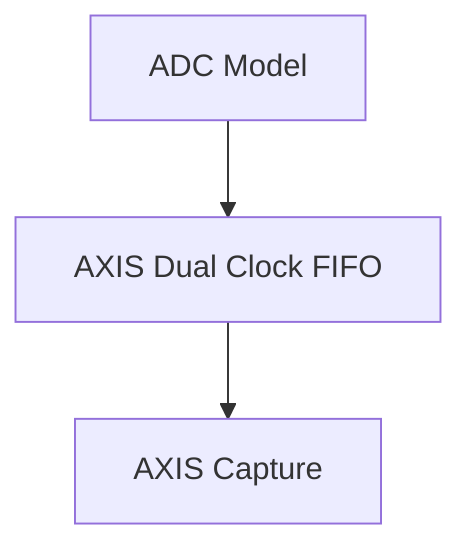
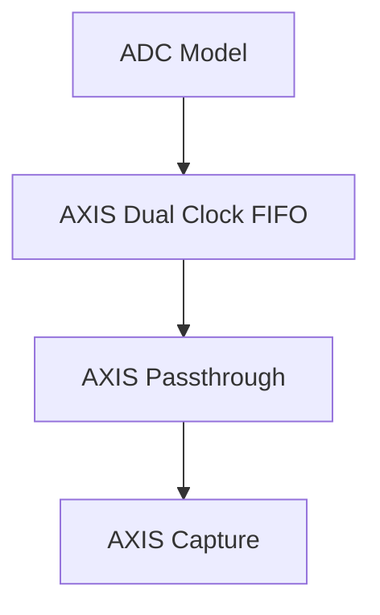

# Dual Clock Integration

The purpose of this testbench was to test and learn more about the XPM AXIS FIFO
and realize its dual indpendent clock functionality.

There are 3 different top modules, each one was a step in the learning process
to test the AXIS FIFO.

1. `dualclk_ctr_top`

First, was to demonstrate that data could at least be captured in sequence and
operate the FIFO correctly by specifying the correct attributues. As well as
test using some of the advanced features such as `rd/wr count` and `prog
full/empty`.

2. `dualclk_adc_pt_vip_top`

The next step was to create a more realistic scenario by using the ADC model
to generate data and simluate the handshake of `s_axis` interface of the OSPFB.
Early on, when creating the `adc_model` and `src_ctr` modules for verification
of the OSPFB the `pt_ctr` module was created just for the `src_ctr` testbench to
verify the AXIS interface on the `src_ctr` and that the `src_ctr` would pause
when `m_axis.tready` was low. It was decided then the best thing to do would to
make it act like how the OSPFB would be designed to inidcate it was ready to
accept samples or that `tready` would be low because it was in the feedback
resampling phase.

This particular scneario was of most interest to test because the OSPFB in its
current design does not accept backpressure. Rather, it assumes tready of all
the downstream is always ready. Therefore, if the OSPFB ever reads from the FIFO
without data being present the OSPFB will insert garbage data into the stream
and data frames will become corrup.

The goal here was to anlayze and test if that once the FIFO was started if it
would every become empty.

It was shown that the FIFO does not go empty. This was verified using the
internal `empty` flag of the FIFO on in the waveform viewer. The `empty` signal
is not present on the output of the AXIS FIFO but since the AXIS FIFO is just an
AXIS implementation wrapper around the base XPM FIFO you can grab the `empty`
signal in simulation and follow it. Empty had never been asserted after
starting. However, there is still a major concern that this is practical. With
this testbench it shows that it can be achieved in simulation. But notice that
just prior to the beginning of the resample period that the almost empty flag is
present showing that there is only one sample left in the FIFO.

The practical concern is that in order to gurantee that the FIFO will never be empty the DSP
clock must be able to be created EXACTLY from the ADC clock at the oversample ratio. If there is
any skew (slow or fast) this may eventually cause the clocks to drift apart. In the case that
the DSP clock is slightly faster than the perfect ratio the FIFO will be emptied after a
certain number of iterations. In the case that the DSP is slightly slower then the FIFO will
eventually fill up. Of the two scenarios the better one would be to have a slightly slower
clock with a really deep fifo in hopes that the system can be restarted.

3. `dualclk_adc_vip_top`

Finally, this last case was to remove the AXIS passthrough module imitiating the
OSPFB AXIS interface and to capture a continous sequence of data. This would be
the golden data that the passthrough version had to match. The idea being that
if the passthrough capture matched this then we have shown that that the OSPFB
interface would not be a problem and that the FIFO did not go empty.
